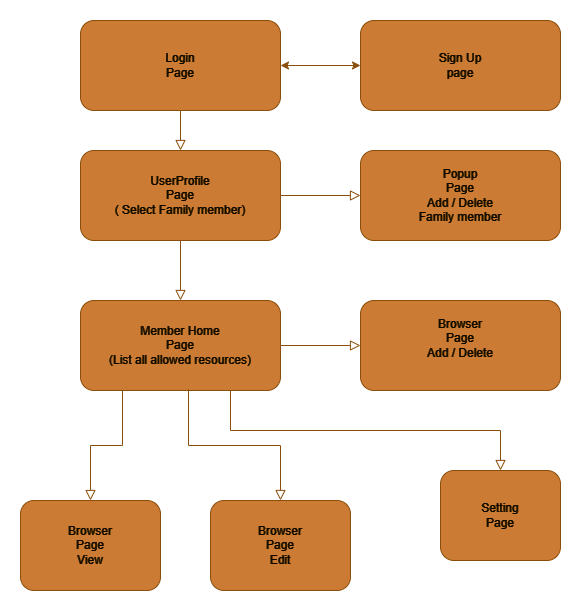

# Kid Web Browser for Android Pad 😄

Platform: Android

Languages: JavaScript

Framework: Expo React Native

## Main Features:

1. Button list for web resources
2. Custom URL list for each web resource
3. Parent Control
4. No sleep screen
5. Login / register
6. Storge resources for each user
7. One resource include:

title, icon, defualt page, allow page list (inclue title or url keyword, or the whole specific url )
Kid lock, full screen

## Pages:

- SignUp page
- Login page
- User home page (list the preset resources, each resource show at a card view with title detail and entry button) and a custom button to add resources to this user. Share button to share the resources to others users.
- Web browser page (browser view and edit view)
  Browser view just allow whitelist resource and show meno. If not allow page. it will go back to default page.
  Edit view has url bar and whitelist edit (add, edit delete whitelist and meno)

## Procedure



## Data Structre

#### Account List object

```
myAccountList = [
    {
        accountID: GenerateNewId("account"),
        nickname: text_nickname,
        username: text_username,
        email: text_email,
        password: text_password,
    },
    {....}
];

#### Account profile object

myAccountProfile = {
    owner: "accountID",
    profile:{
        setting1: "aa",
        setting2: "bb",
    },
    memberlist:[
        {
        mid: "0",
        title: "Add Person",
        description: "Add your kid or family member",
        icon: "https://www.google.com/favicon.ico",
        memo: "",
        status: "0",
        },
        {
        mid: GenerateNewId("member"),
        title: "Ken",
        description: "Boy",
        icon: "https://www.google.com/favicon.ico",
        memo: "Son",
        status: "0",
        },
        {...}
    ]
};


#### Resource profile object

myResourceProfile = {
    owner: "memberID (mid)",
    resourcelist:[
        {
            rid: "0",
            title: "Add resource",
            description: "Add resource",
            default_url:""
            icon: "https://www.google.com/favicon.ico",
            memo: "",
            status: "0",
            url_filter:"",
            title_filter:"",
            whitelist:"",
        },
        {
            mid: GenerateNewId("resource"),
            title: "facebook",
            description: "facebook",
            defaulturl:"https://www.facebook.com"
            icon: "https://www.facebook.com/favicon.ico",
            memo: "",
            status: "0",
            url_filter:["facebook.com","www.faceook.com"], #the url must include "facebook.com" or "www.facebook.com"
            title_filter:["facebook","face"], #the title must include "facebook" or "face"
            whitelist:["www.facebook.com"], # Allow all url in this field.
        },
        {...}
    ]
};
```
